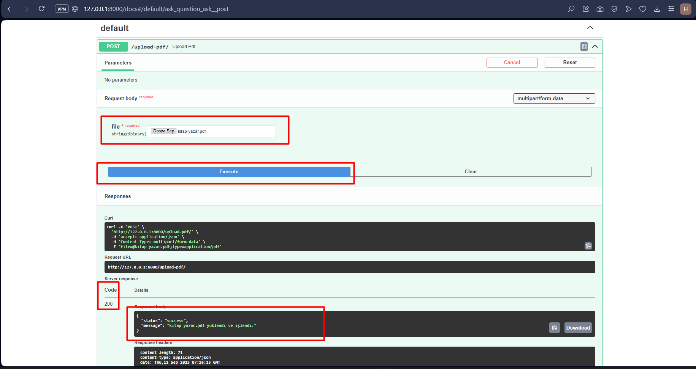
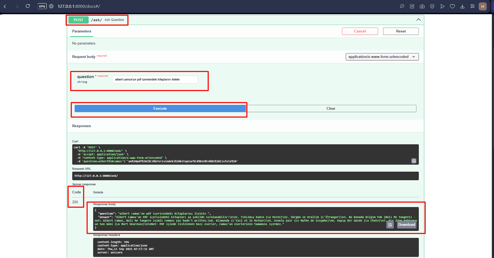

# 📄 PDF Reader FastAPI (RAG-based Q\&A)

Bu proje, **FastAPI** tabanlı bir API servisidir.
Kullanıcılar PDF dosyası yükleyebilir ve bu PDF içeriği hakkında sorular sorabilir.
Sistem, **LangChain + Ollama + FAISS** kullanarak embedding tabanlı **Retrieval-Augmented Generation (RAG)** mantığında çalışır.

---

## 🚀 Özellikler

* 📂 PDF yükleme ve metin çıkarma (PyPDF2)
* ✂️ Metinleri chunk’lara bölme
* 🔍 **FAISS** ile embedding tabanlı semantik arama
* 🧠 **Ollama (LLaMA modelleri)** ile doğal dilde cevap üretme
* 📝 Soru-cevap için `/ask` endpoint
* 🌐 Swagger UI desteği ([http://127.0.0.1:8000/docs](http://127.0.0.1:8000/docs))

---

## 🛠️ Kurulum

### 1. Depoyu klonla

```bash
git clone <repo-url>
cd PDF_READER_FASTAPI
```

### 2. Ortamı hazırla

```bash
conda create -n nlp_projects python=3.10 -y
conda activate nlp_projects
```

### 3. Gereksinimleri yükle

```bash
pip install -r requirements.txt
```

### 4. Ollama’yı indir ve çalıştır

👉 [Ollama](https://ollama.ai/) kurulu olmalı ve çalışıyor olmalı.
Projede `llama3.2:3b` ve `mxbai-embed-large` modelleri kullanılıyor.

```bash
ollama pull llama3.2
ollama pull mxbai-embed-large
```

---

## ▶️ Çalıştırma

```bash
uvicorn main:app --reload
```

Ardından tarayıcıdan:
👉 [http://127.0.0.1:8000/docs](http://127.0.0.1:8000/docs) adresine git.

---

## 📌 API Endpoint’ler

### Ekran Görüntüleri 






### 1. PDF Yükleme

**POST** `/upload-pdf/`

Form-data:

* `file`: PDF dosyası

Dönüş:

```json
{
  "status": "success",
  "message": "example.pdf yüklendi ve işlendi."
}
```

---

### 2. Soru Sorma

**POST** `/ask/`

Form-data:

* `question`: PDF içeriğiyle ilgili soru

Dönüş:

```json
{
  "question": "Bu PDF’de yapay zekanın tanımı nedir?",
  "answer": "Yapay zekanın tanımı şudur..."
}
```

---

## 🧩 Proje Yapısı

```
PDF_READER_FASTAPI/
│── main.py          # FastAPI uygulaması (API endpointleri)
│── utils.py         # PDF işleme & FAISS index fonksiyonları
│── requirements.txt # Gereken kütüphaneler
│── README.md        # Proje dokümantasyonu
```

---

## 📖 Örnek Kullanım

1. Önce `/upload-pdf/` ile PDF yükle.
2. Sonra `/ask/` endpointine sorunu gönder:

   * Örn: `"Bu makalede sonuç kısmı nedir?"`
3. Sistem embedding araması yapar → en alakalı chunk’ları bulur → LLM’e gönderir → cevap döner.

---

## 📌 Notlar

* Eğer **`python-multipart` hatası** alırsan:

  ```bash
  pip install python-multipart
  ```
* Ollama modellerini yüklemeden çalıştırırsan hata alırsın.

